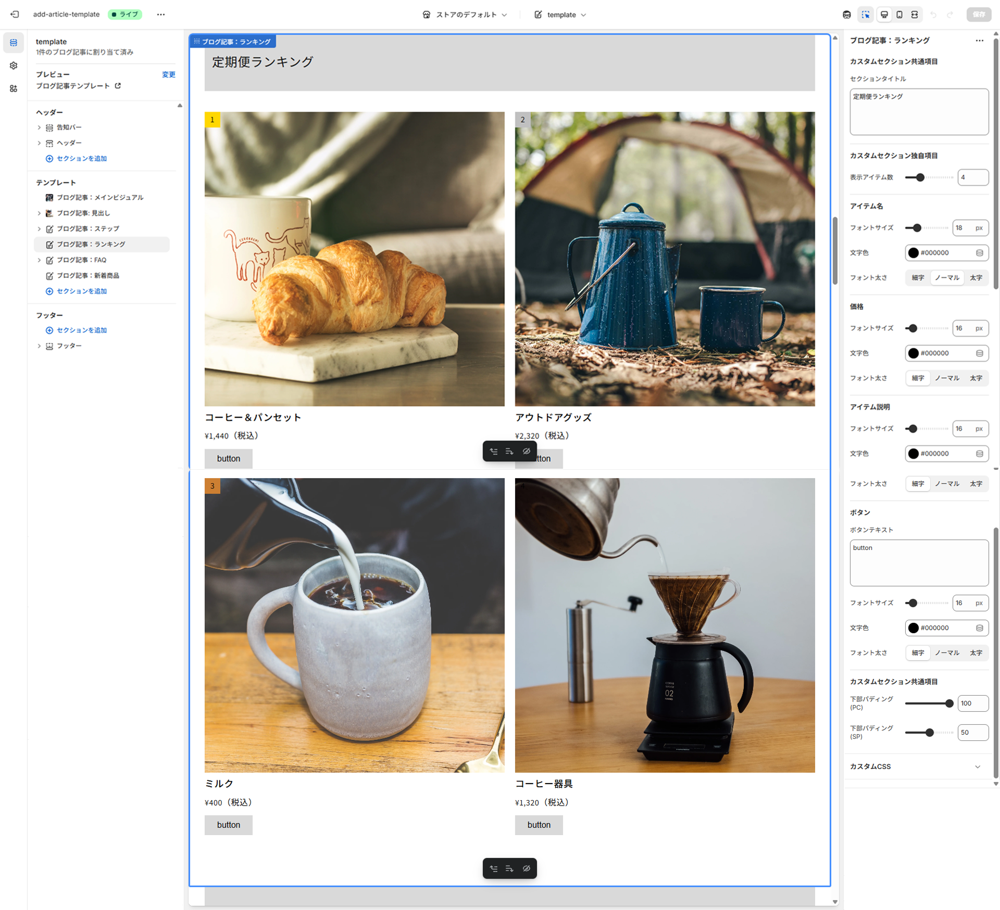

# template-page – 架空ECサイト用ブログ記事テンプレート

## 概要
Shopifyのブログ記事作成を簡略化するためのテーマテンプレートです。  
管理画面からほとんどコード編集を行わずに、記事のデザインやレイアウトを整えられるよう設計しています。

## 目的・背景
ITに詳しくないクライアントでも、ブログ記事をスムーズに作成できる環境を提供することを目的に制作しました。  
ブログ記事のレイアウト・フォントサイズ・表示アイテム数などを管理画面の設定から変更できるようにし、運用の負担を減らしています。

## 技術構成
- Shopify（Liquid）
- HTML5 / CSS3
- JavaScript (ES6)
- GitHub

## 実装ポイント
- **動的生成**：Liquidを用いて商品一覧を動的に生成
- **テーマ設定から変更可能**：表示アイテム数・フォントサイズ・表示項目などを管理画面から設定
- **レスポンシブ対応**：異なるサイズの画像を自動的に統一し、スマートフォン・タブレット・PCで最適化
- **ランキングバッジ表示**：ランキングセクションに1~3位のバッジを自動表示
- **シンプルUI**：不要な項目を削除し、記事作成に必要な最低限の入力欄だけを表示

## 画面イメージ
カスタマイズ画面全体
  

カスタマイズUIイメージ
  

## 補足
- このテンプレートは**架空のECサイト**を想定して作成したデモ用テーマです。
- 実在する企業・商品・ブランド名・画像とは一切関係ありません。
- 画像素材は [Burst](https://www.shopify.com/stock-photos) の著作権フリー画像を使用しています。
